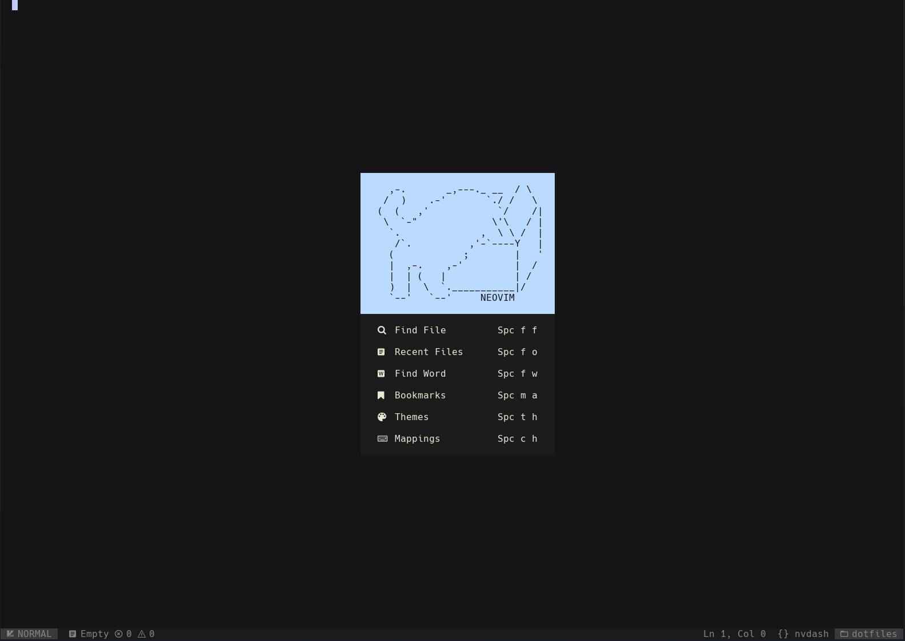

# DOTFILES



~/.config  
　　├── starship.toml  
　　├── .tmux.conf  
　　├── setup.sh  
　　└── nvchad_config/

## Requirements

- Neovim > 0.9.0
- [Nerd Font](https://www.nerdfonts.com/)
- [Ripgrep](https://github.com/BurntSushi/ripgrep)
- npm
- treesitter

## Installation

```bash
git clone https://github.com/kwon-evan/dotfiles.git ~/dotfiles/ --depth 1
cd ~/dotfiles/
./setup.sh
```
